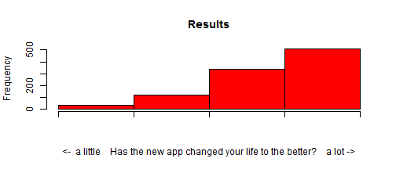

## New shiny app

As you probably allready know, there is a fantastic new Shiny app released which let's you make two sided t-tests on the fly!

---

## Is it any good?

By now, you are probably a little skeptical as to why this new Shiny app will be of any use to you?

Well, be prepared to hear what others who have tested the new app have to say

Let's look at a study by well-known scientists where 1,000 respondents were asked how this new shiny app have changed there lives...

---

## Survey results

```r
x<-cbind(c(1:1000),rep(5,1000))
set.seed(1);xl<-"<-  a little    Has the new app changed your life to the better?    a lot ->"
sceptics <- sample(c(1:1000),400);x[sceptics,2]<-4
sceptics <- sample(c(1:1000),120);x[sceptics,2]<-3
sceptics <- sample(c(1:1000),30);x[sceptics,2]<-2
hist(x[,2],c(1:5),main="Results",xlab=xl,col="red",axes=FALSE)
Axis(side=1, labels=FALSE);Axis(side=2, labels=T)
```

 


---

## Thank you!

Thank you for viewing this entire slide show

Now you can celebrate by trying the new t-test shiny app yourself:

[T-test](https://jnsoft.shinyapps.io/DevDataProducts/)

(I hope you did not take offense because of deliberately exaggerated and fabricated facts about this new t-test shiny app)
